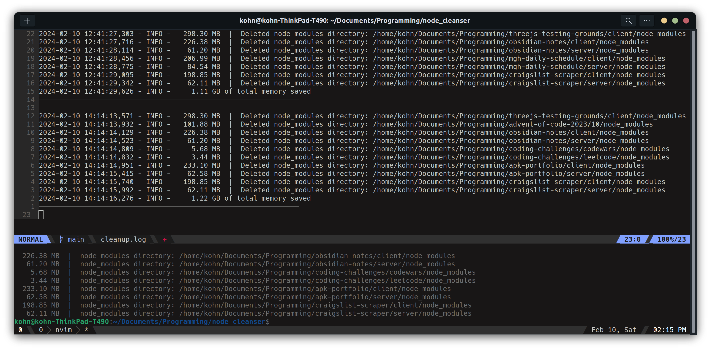

<h1 align='center'>node_cleanser</h1>

<div align='center'>
  
  
  
</div>

<div align='center'>
  
</div>



<hr />

### Description

JS blesses the user with /node_modules, and the user can now throw it into the void where it belongs.

Welcome to node_cleanser, where this app will cleanse the body of your directories from /node_modules and your mind can be at ease. All that's required is that you provide the base directory of where you want the script to start from. It will walk through all directories in the base directory and will search and delete the top-level node_modules folder. A log of what was deleted will be posted in the cleanup.log that can be found in the node_cleanser folder after running the app for the first time.

```
[x] = target for deletion

BEFORE                                            AFTER
├── app_title_1/                                  ├── app_title_1/
│   └── node_modules/  [x]                        ├── app_title_2/
├── app_title_2/                                  │   └── other_dir/
│   ├── node_modules/  [x]                        └── app_title_3/
│   └── other_dir/                                    └── dir_a/
│       └── node_modules/  [x]                            └── dir_b/
└── app_title_3/
    └── dir_a/
        └── node_modules/  [x]
        └── dir_b/
            └── node_modules/  [x]
                └── foo
                    └── node_modules/
```

#

### Usage

###### Requirement: Python ver. 3.10.12 or newer

```
git clone https://github.com/AndrewKohn/node_cleanser.git

cd node_cleanser
python3 node_cleanser.py
```

When the prompt asks for the directory path location, please provide the full path to the base directory. If you are unsure of the path, you can open your directory and check it's properties

##### Example:

```
Linux:    /home/username/Documents/Programming
Windows:  C:\Users\Username\Documents\Programming
Mac:      /Users/username/Documents/Programming
```

In this example, the script will contain it's search within the /Programming directory and any nested directories within it.

#

### Roadmap

General:

- [ ] create tests
- [ ] input validation / Error handling
- [ ] improve disk space usage efficiency (platform-specific utilities to sum mem. space)
- [ ] improve logging, look into other levels

Features:

- [ ] backup / restore functionality

User interactivity:

- [ ] simple gui
- [ ] option for automatic cleanup and interactive cleanup (prompt user for confirmation before deletion)
- [ ] clean-up rules (list directories in gui and user can select to ignore certain directories)
